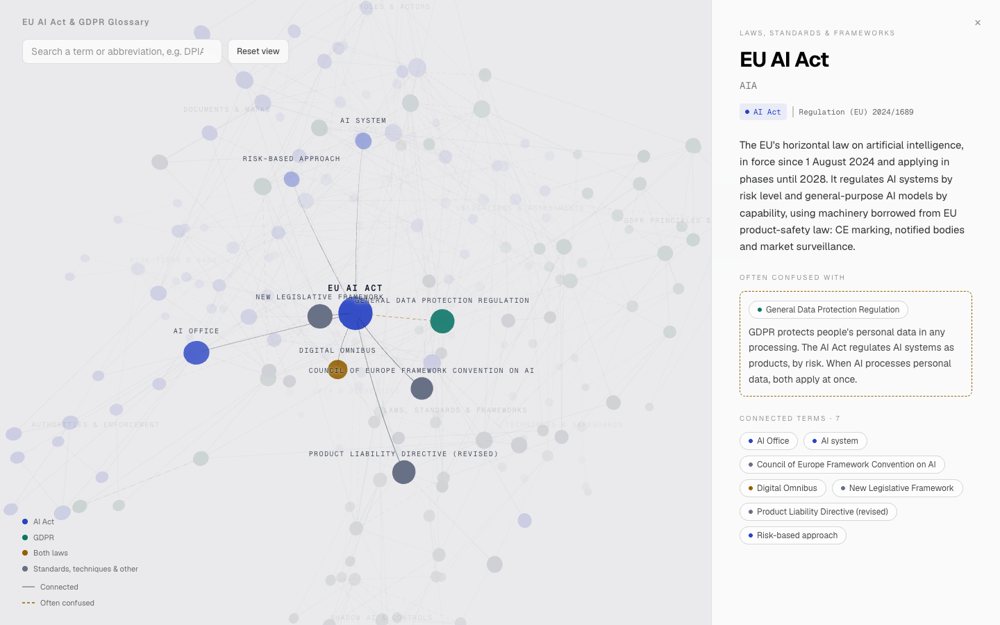

# EU AI Act & GDPR Glossary

**Live: [3d-graph-one.vercel.app](https://3d-graph-one.vercel.app)**

An interactive 3D map of 206 EU AI Act, GDPR and Shadow AI terms and how they connect, built with React, Next.js and Three.js. Search a term such as *DPIA* or *deployer*, or click any node to read its plain-language definition, its legal source and the terms it's often confused with.

[](https://3d-graph-one.vercel.app)

The interaction is inspired by Matt Pocock's [AI Coding Dictionary](https://www.aicodingdictionary.com/), whose dynamics I reverse-engineered; the glossary below explains the techniques.

## What's in it

| | Count |
| --- | --- |
| Terms | 206 (96 AI Act, 42 GDPR, 4 both laws, 64 standards, techniques and other laws) |
| Topics | 11: Core concepts, Roles & actors, Risk tiers & bans, Obligations & assessments, Documents & marks, Data & biometrics, GDPR principles & rights, Authorities & enforcement, Techniques & safeguards, Laws, standards & frameworks, Shadow AI & controls |
| Relations | 541 (511 related, 30 "often confused" with a note on the difference) |

- **Colour** shows the law a term comes from; **size** grows with its number of connections; each **cluster** is a topic.
- **Solid** edges connect related terms; **dashed** edges mark pairs that are often confused.
- The page opens on **EU AI Act**. *Reset view* returns there; *Escape* or a click on empty space shows the whole graph.
- Every term has its own page and link, e.g. [`/terms/dpia`](https://3d-graph-one.vercel.app/terms/dpia). Selecting a node updates the URL, and opening a term's URL selects it.

Definitions are plain-language summaries for learning, not legal advice.

## Running it locally

```bash
npm install
npm run dev          # http://localhost:3000
npm run check-data   # validate src/data/graph.json (also runs before every build)
```

## Glossary & Core Concepts

Before diving into the implementation, here are the key algorithms, terms, and libraries used to build this:

- **`Three.js`**: The foundational WebGL library used to render the 3D scene (spheres, lines, lights, cameras).
- **`d3-force-3d`**: A physics engine used to calculate the positions of nodes. It simulates forces (like gravity pulling everything to the center, or repulsion pushing nodes apart) to naturally organize the graph in 3D space.
- **`camera-controls`**: A library built on top of Three.js that provides smooth, damping-based user interactions (drag to rotate, scroll to zoom) around a fixed focal point.
- **`Quaternion`**: A mathematical construct used to represent 3D rotations without encountering "gimbal lock" (where axes align and lose a degree of freedom). We use quaternions to calculate the shortest rotational path between the camera and a clicked node.
- **`Slerp` (Spherical Linear Interpolation)**: An algorithm to smoothly transition between two quaternions. This is what creates the curved, natural "globe spinning" effect.
- **`Lerp` (Linear Interpolation)**: An algorithm to smoothly transition between two values (like distance, color, or scale).
- **`Easing (easeInOutCubic)`**: A mathematical function that modifies the speed of an animation. Instead of moving at a constant speed, the animation accelerates from a stop, moves quickly through the middle, and decelerates gently to a stop.
- **`Raycaster`**: A technique in 3D graphics that shoots an invisible line from the mouse pointer into the 3D scene to determine which objects it intersects (used for hover and click detection).
- **DOM Projection**: The technique of calculating the 2D screen coordinates of a 3D object and placing standard HTML elements (like `<div>` text labels) at those coordinates, allowing crisp text rendering and standard CSS styling.

## The Data Model

Everything the graph shows comes from one file, [`src/data/graph.json`](src/data/graph.json), with three lists. No terms are written into the code: adding a term to the file adds a node.

- **`topics`** — `id` and `name`. Each topic is one cluster, and its name labels the cluster.
- **`terms`** — one node each: `id`, `name`, `abbreviations`, `aliases`, `law` (`aiact`, `gdpr`, `both` or `other`, which sets the node colour), `topic`, an optional `source` (e.g. `Art. 3(4)`) and a plain-language `definition`.
- **`relations`** — one edge each: `from`, `to`, and `type`. A `related` edge is drawn solid. A `contrasts` edge ("often confused") is drawn dashed and needs a `note` explaining the difference, shown in the side panel.

The first 179 terms and 10 topics come from the 2D AI Act & GDPR lexicon prototype. The **Shadow AI & controls** topic adds terms on how company data reaches AI tools and the controls that govern it, and links into the lexicon (deployer, logging, pseudonymisation, international transfers, …).

### One page per term

`src/app/terms/[id]/page.tsx` builds a static page for every term (`generateStaticParams`), with its own title, description, canonical URL and schema.org `DefinedTerm` data; `sitemap.xml` lists them all. The side panel is a Server Component (`TermArticle`), so the definition and the links to connected terms are plain HTML that works without JavaScript.

The WebGL graph is rendered by the root layout, not the pages, so it stays mounted while pages change beneath it: navigating only moves the selection. The URL is the source of truth (`/` shows EU AI Act, `/terms/<id>` shows that term).

`npm run check-data` validates the file: unique ids, known laws and topics, no relation pointing at a missing term, no duplicate pairs, and a note on every `contrasts` relation. It runs automatically before every build (`prebuild`), so a bad edit fails the deploy instead of shipping a broken graph.

## Step-by-Step Implementation Guide

The core application logic is encapsulated inside the `<Graph3D />` React component. Here is exactly how the visualization works under the hood:

### 1. Initialization and Physics Layout

When the component mounts, a `THREE.Scene`, `WebGLRenderer`, and `PerspectiveCamera` are created. The data file is fed into `d3-force-3d` (`src/lib/graphLogic.ts`).

- **Topic clusters**: each topic gets an anchor point, spread evenly over a sphere with a Fibonacci lattice. `forceX`/`forceY`/`forceZ` pull every term toward its topic's anchor, while `forceLink` and `forceManyBody` let related terms settle near each other.
- **Deterministic layout**: the simulation uses a seeded random source, so the graph looks the same on every load.
- We tick the physics simulation 400 times up front so the nodes start in their final, stable positions before the first frame is drawn.
- **Depth cue**: fog fades the far side of the graph toward the background, so front and back clusters don't read as one.

### 2. Scene Graph Hierarchy

Everything (nodes, lines, and text labels) is attached to a master `THREE.Group` called `graphGroup`.

- The camera is fixed and looks exclusively at the origin `(0, 0, 0)`.
- When the user rotates the view using the mouse, they are physically moving the camera in an orbit around the origin.

### 3. Click Interaction & The "Spinning Globe" Math

When a user clicks a node, we do **not** move the camera. Instead, we move the entire universe (`graphGroup`) so the node arrives at the origin, facing the camera.

1. **Calculate Direction**: We take the clicked node's local position and figure out where it is pointing in world space.
2. **Calculate Rotation (`qDiff`)**: We calculate the exact rotational difference between the node's current direction and the camera's fixed direction.
3. **Set Targets**: We apply this rotation difference to the `graphGroup`'s target quaternion. We also calculate the target distance to push the group away from the camera just enough so the node sits exactly at `(0, 0, 0)`.
4. **Trigger Animation**: We record the start time, the start quaternion, and the start position, and set an `isAnimating` flag.

### 4. The Animation Loop (Tweening & DOM Sync)

The `requestAnimationFrame` loop handles the fluid transitions:

- **Movement (`slerp` & `lerp`)**: Using the `easeInOutCubic` curve, we calculate an interpolation factor (`t`) from `0.0` to `1.0` over `800ms`. We apply this to the group's rotation (`slerpQuaternions`) and translation (`lerpVectors`).
- **Visuals**: Inside the same loop, we smoothly interpolate the `THREE.Color` of the nodes, their scale, and the opacity of the curved edge tubes connecting them, so the highlighting happens perfectly in sync with the movement. `contrasts` tubes are cut into dashes by slicing the curve and merging the pieces into one geometry.
- **Labels (DOM Projection)**: For the text labels, we ask Three.js where each node's 3D position currently lives on the 2D screen (`vTemp.project(camera)`). We convert this to CSS pixel coordinates and apply a CSS `transform: translate(x, y)` to the corresponding HTML `<div>`. This keeps the text crisp and easily selectable while feeling perfectly glued to the 3D objects.

## License

- **Code**: [MIT](LICENSE).
- **Glossary data** (`src/data/graph.json`: terms, definitions, relations and notes): [CC BY 4.0](src/data/LICENSE). Reuse it freely with credit and a link back to the site.
